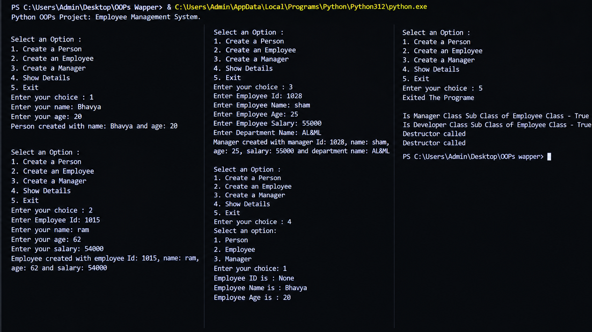

# Employee Management System

 ## Subtitle of the Project

 A simple Python program that manages employee information using Object-Oriented Programming concepts.


 ## About the Project

 This project is a beginner-friendly Python program that provides an interactive menu to manage employees.

 The program allows the user to select from the following options:

* Create a person.
* Create an employee.
* Create a manager.
* Show employee details.
* Exit the program.

 The program demonstrates classes, inheritance,constructor, destructor, encapsulation, method overriding, constructor overloading, and polymorphism.


 ## Output

 


 ## Features

* Displays an interactive menu.
* Creates employee objects.
* Creates manager objects with department information.
* Creates developer objects with programming language information.
* Uses constructors to initialize objects.
* Uses private attributes for data encapsulation.
* Provides getter and setter methods.
* Uses inheritance between Employee, Manager, and Developer classes.
* Overrides the `display()` method.
* Uses `super()` to access parent class functionality.
* Uses `isinstance()` to check class relationships.
* Demonstrates constructor/method overloading.
* Displays employee details.
* Allows the user to exit the program.

 ## Learning Objectives

 By completing this project, you can learn:

* How to create classes and objects in Python.
* How to use constructors and destructors.
* How to implement encapsulation.
* How to use getter and setter methods.
* How to implement inheritance.
* How to override methods.
* How to use polymorphism.
* How to use `super()`.
* How to use `isinstance()`.
* How to implement constructor/method overloading.
* How to create a menu-driven Python program.
* How to manage employee information using OOP concepts.


 ## Concepts Used

* Classes and objects.
* Constructors and destructors.
* Encapsulation.
* Private attributes.
* Getter and setter methods.
* Inheritance.
* Method overriding.
* Method overloading.
* Polymorphism.
* `super()` function.
* `isinstance()` function.
* User input.
* Conditional statements.
* Menu-driven programming.

 ## How to Run

 ### Step 1: Install Python

```bash
https://www.python.org/downloads/
```

 ### Step 2: Run the Program

```bash
python main.py
```

 ## Project Structure

``` text
│
├── main.py
├── output.png
└── README.md
```

 ## Technology Used

* Python
* Visual Studio Code (VS Code)
* Git
* GitHub

 ## Author
Bhavya Sahetiya